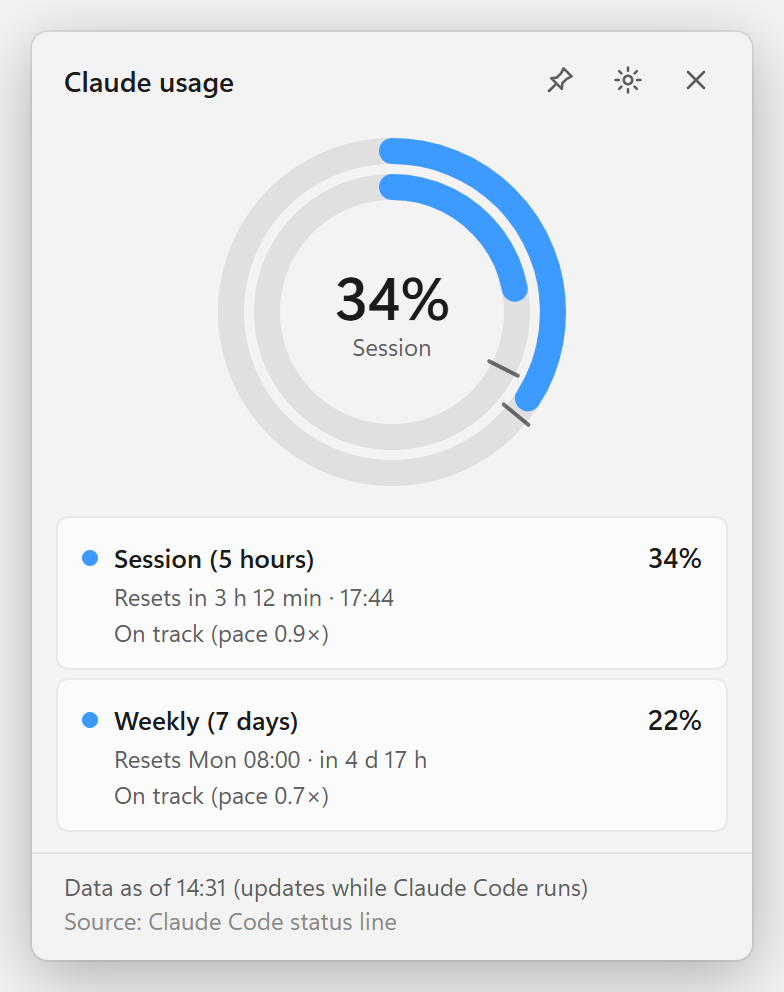
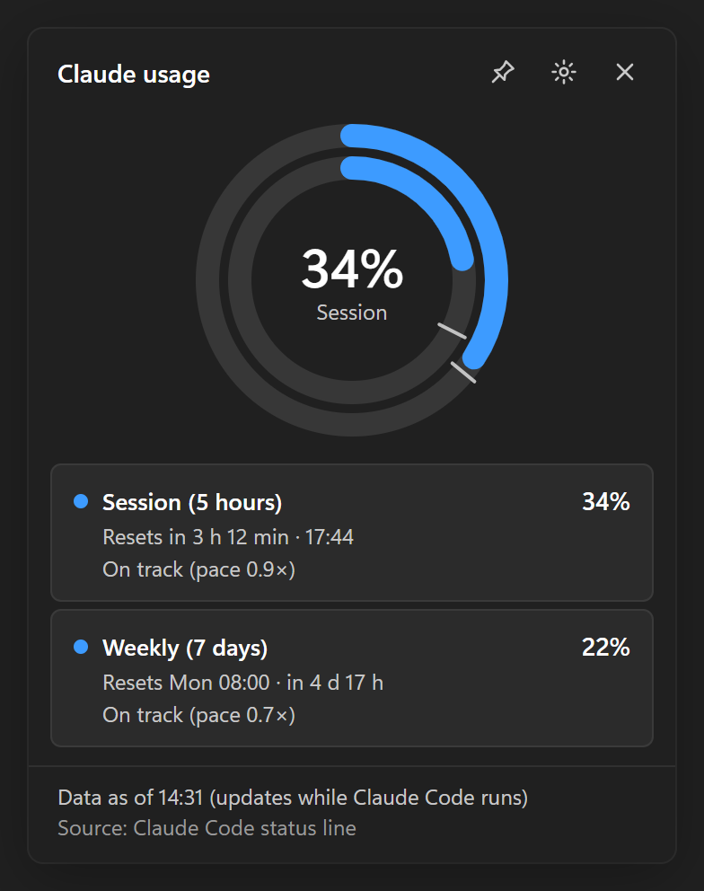
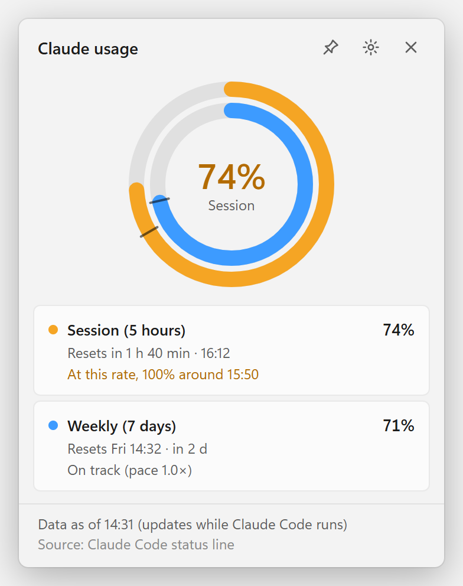
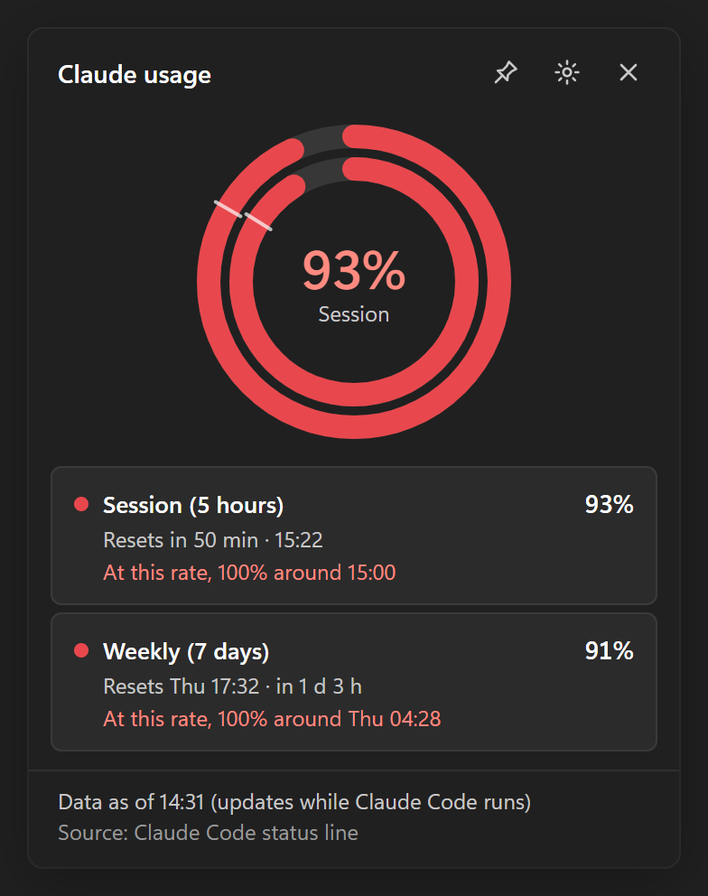
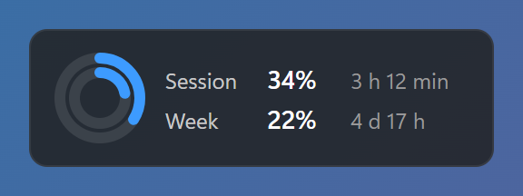
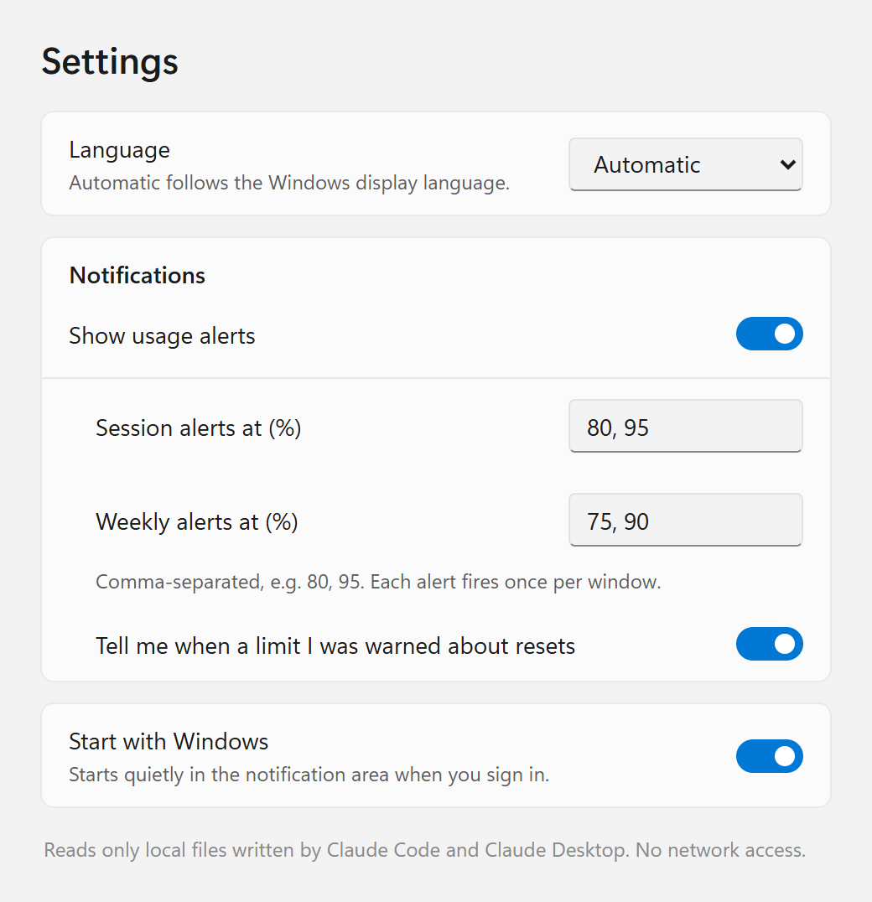

# Claude Usage Widget

A small Windows 11 tray app that shows your Claude subscription usage at a glance: the current
**5-hour session** and the **7-day weekly** limit, each with its reset countdown and a pace indicator
that tells you whether you are spending faster than the window allows.

It reads only what Claude Code already hands to its status line, on your own machine. It makes no
network request and never touches your credentials.

| Light | Dark |
|---|---|
|  |  |
|  |  |

- **Tray icon** — a ring filled to the session percentage. Blue when on pace, amber when spending
  ≥ 1.1× faster than even, red at ≥ 1.75× or ≥ 90 % used, grey when the data is stale or missing.
  Hover for `Session 14% · resets 3h49 | Week 8% · resets Wed 06:00`.
- **Card** (left-click) — concentric rings (session outside, weekly inside), each with a marker showing
  where "even spend" would be now, the reset countdown and a one-line pace message.
- **Pinned widget** (right-click → Pin widget) — a small always-on-top card you can drag anywhere.
- **Alerts** — one Windows notification per window when usage crosses a threshold (defaults: session
  80 % and 95 %, weekly 75 % and 90 %), optionally one when a limit resets.
- **Settings** — thresholds, language (English / French, from Windows by default), notifications,
  start with Windows.

| Pinned widget | Settings |
|---|---|
|  |  |

More states (stale data, window reset, no data yet, Claude Desktop only, French) are in
[`docs/screenshots/`](docs/screenshots/).

## Install

1. Download `Claude Usage Widget_0.1.0_x64-setup.exe` from the
   [Releases page](https://github.com/oallaire-cyber/Claude_Usage_Widget/releases) and run it.
   It installs for your user only (no administrator rights), into
   `%LOCALAPPDATA%\Claude Usage Widget\`, with a Start-menu shortcut.

   > **SmartScreen:** the installer is not code-signed, so Windows may show "Windows protected your
   > PC". Click **More info → Run anyway**. You can check the file first: right-click → Properties →
   > the publisher is unknown, which is expected for an unsigned build.

2. **Hook the bridge into Claude Code** — the installer deliberately does *not* do this, so nothing
   changes in your Claude Code settings until you choose to. In **Windows PowerShell**:

   ```powershell
   powershell -NoProfile -ExecutionPolicy Bypass -File "$env:LOCALAPPDATA\Claude Usage Widget\tools\install-bridge.ps1"
   ```

   The script:
   - copies `cuw-bridge.exe` to `%LOCALAPPDATA%\ClaudeUsageWidget\bin\` (a path without spaces, so the
     command works whichever shell Claude Code uses);
   - makes a timestamped backup of `%USERPROFILE%\.claude\settings.json`, then sets its `statusLine` to
     the bridge, keeping every other setting as it was;
   - if you already had a status line, keeps it: the bridge runs your previous command and shows its
     output unchanged. Otherwise the status line shows a compact `5h 14% · 7d 8%`.

   Running it twice changes nothing.

3. Start the app from the Start menu (and tick **Start with Windows** in its right-click menu if you
   like). Send one message in Claude Code: the numbers appear.

**After updating the app**, run the install script again so the copied bridge is refreshed.

## Uninstall

1. First unhook the bridge — this restores your previous `statusLine` exactly (or removes it if there
   was none) and deletes the copied bridge:

   ```powershell
   powershell -NoProfile -ExecutionPolicy Bypass -File "$env:LOCALAPPDATA\Claude Usage Widget\tools\uninstall-bridge.ps1"
   ```

2. Then uninstall **Claude Usage Widget** from Windows Settings → Apps.

Your usage history stays in `%APPDATA%\ClaudeUsageWidget\`; delete that folder if you want it gone.

## How the data flows

```
Claude Code ──(status-line JSON on stdin, after each reply)──▶ cuw-bridge.exe
                                                                 │  prints the status line back
                                                                 ▼
                                    %APPDATA%\ClaudeUsageWidget\state.json  (+ history.jsonl)
                                                                 │  file change notification
                                                                 ▼
~/.claude.json (usage cache, if present) ─────────────▶  Claude Usage Widget (tray)
Claude Desktop plan-usage-history.json (fallback) ────▶  merges, computes pace, shows, alerts
```

1. **Status line (primary).** Claude Code runs its configured status-line command after each reply and
   pipes it a JSON payload that includes `rate_limits` (used percentage and reset time for each window)
   for Pro and Max subscribers. The bridge saves those windows to `state.json`. When several Claude Code
   sessions run at once, it keeps the highest value per window so a quiet session never drags it down.
2. **Claude Code's usage cache (secondary).** If `~/.claude.json` contains a `cachedUsageUtilization`
   block, only that block is parsed.
3. **Claude Desktop's history (fallback).** Percentages only, no reset times — used only when the other
   two are missing or stale, and the card then says countdowns and pace are unavailable.

Per window the freshest valid value wins, with the status line preferred whenever it is current. The
card's footer shows the source and "Data as of HH:MM".

## Privacy

- The app reads **only** the rate-limit fields Claude Code pipes to the status line, plus the usage
  fields named above from Claude Code's and Claude Desktop's own local files. Nothing else from those
  files is parsed.
- It **never** reads `~/.claude/.credentials.json`, browser cookies or sessions, and **never** calls
  any Anthropic endpoint or any other server. The app and the bridge make **zero network requests**.
- Nothing is sent anywhere. Everything the app writes stays in `%APPDATA%\ClaudeUsageWidget\`
  (`state.json`, `history.jsonl` — 14 days of samples, at most one per minute — `settings.json`,
  `notify-state.json` (which alerts already fired), `install.json`).

## Known limitations

- **Values update only while Claude Code (or Claude Desktop) runs.** Claude Code refreshes the numbers
  after its own API calls; usage from claude.ai or another device shows up after your next Claude Code
  message. After 30 minutes without an update the card says the data is stale.
- **No model-specific weekly window (e.g. Fable) today.** Claude Code's status line does not include it
  ([anthropics/claude-code#91920](https://github.com/anthropics/claude-code/issues/91920)), and no local
  file on the development machine carries it. The app will show an extra inner ring automatically if the
  status line or Claude Code's usage cache starts providing one.
- **Sources 2 and 3 are undocumented** (`~/.claude.json`'s usage cache and Claude Desktop's history).
  Their format may change or disappear with any update; the app ignores them if they stop parsing.
- **Unsigned build** — SmartScreen warning on first run (see Install).
- Built and checked on Windows 11 only; English and French.

## Build from source

Needs Rust (MSVC toolchain), Node 22 and the WebView2 runtime.

```powershell
cargo build --release -p cuw-bridge
cd app
npm ci
npx tauri build --config src-tauri/tauri.release.conf.json   # installer → target\release\bundle\nsis\
```

Tests: `cargo test --workspace`, and
`powershell -NoProfile -ExecutionPolicy Bypass -File tools/tests/Test-InstallBridge.ps1` for the install
scripts (they only ever touch temporary fake settings files). Design decisions are in
[`DECISIONS.md`](DECISIONS.md), source discovery in [`docs/FINDINGS.md`](docs/FINDINGS.md).

## Credits

No code was copied from these projects; they shaped the design, and are thanked here:

- [pedroprates/claude-code-usage](https://github.com/pedroprates/claude-code-usage) (macOS menu bar) —
  the status line → atomic `state.json` bridge, chaining an existing status line, and keeping the
  highest value per reset time across sessions.
- [michaelpeeters/claude-code-usage](https://github.com/michaelpeeters/claude-code-usage) (MIT) — a
  status-line bridge mode and an installer that never overwrites an existing custom status line.
- [heavyc-dev/heavy-usage](https://github.com/heavyc-dev/heavy-usage) (MIT) — status-line capture and
  per-window threshold bands.

The pace colouring (used ÷ elapsed, with guards early in a window and near the limit) and the even-spend
marker follow ideas from these projects.
